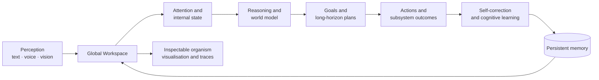
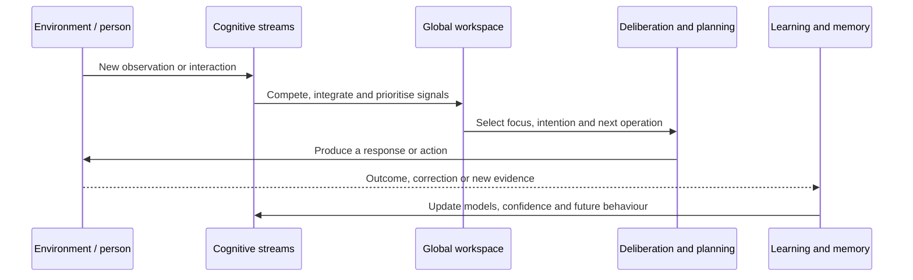

# Cognitive Organism - Beyond J.A.R.V.I.S.

## A research-grade cognitive harness

This project is a **research-grade cognitive harness for building, instrumenting and testing persistent artificial cognition**. It is designed for researchers, engineers and technically curious testers who want to examine what happens when a language model is placed inside a longer-lived system with memory, perception, drives, goals, planning, self-correction and measurable internal state.

The language model is a replaceable reasoning component. The harness supplies the surrounding machinery: stateful cognitive streams, a global workspace, background processing, world-model grounding, action selection, learning signals and inspection surfaces. That distinction is the product.

This repository contains an experimental **cognitive organism**: a local-first research system that combines memory, perception, voice, reflection, planning, self-correction and an evolving visual representation of internal activity.

The ambition is to investigate how persistent state, internal drives, world models, memory, perception and self-evaluation can be assembled into a continuously operating cognitive architecture. It is not a chatbot project and is not presented as artificial general intelligence.

Its value will come from careful engineering, explicit instrumentation, honest evaluation and repeated testing with real people.

## Position in the current landscape

Most public AI products optimise for a polished response loop. Most agent frameworks optimise for tool execution. Most companion systems optimise for continuity of tone and remembered preferences. Cognitive research prototypes often demonstrate one mechanism in isolation. This project occupies a different position: it is an **open, local-first integration and evaluation harness** for studying how these mechanisms interact over time.

| Capability | Consumer assistants | Chatbot / companion products | Agent frameworks | Cognitive research prototypes | This harness |
|---|---|---|---|---|---|
| Persistent episodic and semantic state | Usually limited or opaque | Often preference-focused | Usually application-defined | Often narrow or experimental | Built in and inspectable |
| User and interlocutor modelling | Account/profile layer | Strong persona continuity | Usually left to the developer | Varies by experiment | Persistent profiles linked to interaction and perception |
| Perception beyond text | Product-specific | Usually limited | Connector-dependent | Often modality-specific | Voice, camera, vision memory and face recognition paths |
| Autonomous background cognition | Mostly hidden or task-triggered | Proactive messaging, usually opaque | Schedulers and workers | Frequently simulated or narrow | Goals, thought streams, workspace competition and orchestration |
| Intention, causal and temporal reasoning | Prompt-dependent | Prompt-dependent | Tool or workflow dependent | Research-specific | Dedicated reasoning and planning subsystems with state |
| Self-correction from outcomes | Mostly implicit | Feedback may be product-level | Developer-defined | Often evaluated experimentally | Corrections, evidence, competing strategies and learned behavioural rules |
| Inspectability and telemetry | Low | Low to medium | Logs and traces | Instrumentation varies | Cognitive traces, health data, subsystem outputs and 3D state view |
| Local model and hardware control | Rarely central | Rarely central | Possible | Common | First-class LM Studio, Ollama, local voice and camera operation |

This is a capability comparison, not a claim that the organism outperforms every commercial system on general language quality. The comparison concerns **architecture, persistence and inspectability**. Response quality still depends on the selected model, prompt context, hardware and the quality of the evidence collected by each subsystem.

## Why “harness” matters

The harness is intended to make cognitive claims testable rather than merely conversational. A subsystem should be able to produce observable functional output:

- memory should retrieve relevant prior evidence, not just store text;
- perception should update a grounded world state and identify people when configured;
- intention reasoning should distinguish the main action from incidental details;
- planning should maintain dependencies, time constraints, progress and revision;
- self-correction should preserve lessons from explicit errors and test competing repairs;
- background cognition should feed the global workspace without hijacking active interaction;
- telemetry should expose enough provenance to explain why a subsystem acted.

The project therefore treats failures, empty outputs and “no evidence” states as research data. A high score is earned through repeatable tests, not through a convincing narrative generated by the model.

## System at a glance



## Cognitive cycle



## What the organism does

- **Interaction layer:** local or remote OpenAI-compatible model providers are used as one component of the organism, not as the organism itself.
- **Memory:** episodic and semantic memory, persistent user/interlocutor profiles, relations and retrieval.
- **Reasoning and planning:** intention extraction, causal and temporal reasoning, autonomous goals, long-horizon plans and action outcomes.
- **Self-correction:** explicit user corrections become behavioural evidence; complex tensions can be grouped into competing corrective strategies and evaluated over time.
- **Voice:** Whisper or faster-whisper speech recognition, configurable TTS providers and interruptible audio conversation.
- **Vision:** camera capture, image analysis, face recognition, vision memory and optional multimodal routing.
- **Cognitive workspace:** background signals from attention, curiosity, affect, identity, memory, planning and orchestration.
- **Observability:** cognitive health, traces, subsystem state and a live 3D organic sculpture representing current activity.
- **Local-first operation:** designed to run on the local machine and connect to local LM Studio or Ollama servers.

## Current status

The cognitive organism is an active research prototype. Some subsystems are mature enough for daily testing; others are deliberately exposed so that their limits can be measured. The interface and internal architecture are evolving together.

### Research maturity

The current system is strongest as an integrated experimental platform: it already connects more cognitive mechanisms than a conventional chat interface, while remaining small enough to inspect and modify locally. It is not yet a scientifically validated model of consciousness, general intelligence or human-level reasoning. The next improvements should come from benchmark fixtures, longitudinal conversation tests, ablations, latency measurements and independent tester reports.

## Installation

### Linux

```bash
chmod +x setup.sh
./setup.sh
```

### Windows

Run `start.bat`. The script creates the Python virtual environment, installs Python dependencies, installs optional face-recognition support when possible, installs frontend dependencies, builds the React interface and starts the server.

The new interface is served at `http://localhost:8080/next/`.

The frontend is intentionally built during installation. A published checkout needs `frontend/src`, `frontend/public`, `frontend/package.json` and `frontend/package-lock.json`; `frontend/node_modules` and `frontend/dist` are generated and should not be committed.

## Local model setup

The organism works best for local testing with an OpenAI-compatible server such as LM Studio or Ollama. Configure the provider, model and base URL in the settings page or `config.json`. Keep API keys in `.env` or local configuration; never commit them.

## Testing

Python tests are in `tests/`. Frontend tests are in `frontend/tests/`.

```bash
python -m unittest discover -s tests -v
cd frontend
npm test
```

Some optional tests require the full virtual environment and external services. A test report should mention which providers, models and optional hardware were available.

## Help advance the research

New research testers are welcome, especially people who can evaluate one of these areas:

- multilingual conversation and response-length modes;
- LM Studio, Ollama and other OpenAI-compatible providers;
- audio latency, barge-in, STT and TTS provider selection;
- camera devices, face recognition and multimodal vision models;
- memory recall, user profiles and correction learning;
- autonomous goals, planning, causal reasoning and temporal understanding;
- accessibility, privacy, installation and failure recovery.

You do not need to accept the project’s claims. The most useful testers try to falsify them: repeat a task, inspect the trace, restart the system, change the local model, introduce a correction and check whether later behaviour actually changes. This is how the cognitive organism becomes better than a compelling demo.

Useful tester reports include the operating system, Python and Node versions, provider/model, exact steps, expected result, observed result and a redacted log excerpt. Do not include API keys, face images or private conversation data.

## Privacy and safety

The organism can process text, microphone input, camera frames and face data. Run it only on a trusted machine, keep LAN exposure disabled unless deliberately needed, and review the local data directories before sharing diagnostics. The project is experimental and should not be used as the sole basis for medical, legal, safety-critical or personal security decisions.

## License

Add the project license before public release. Until then, treat this repository as source-available experimental software rather than assuming that redistribution terms are defined.
