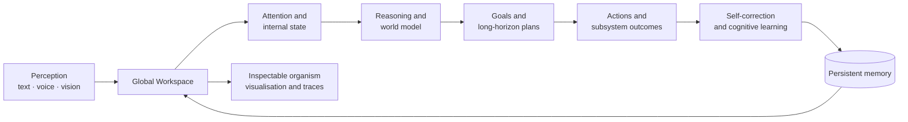
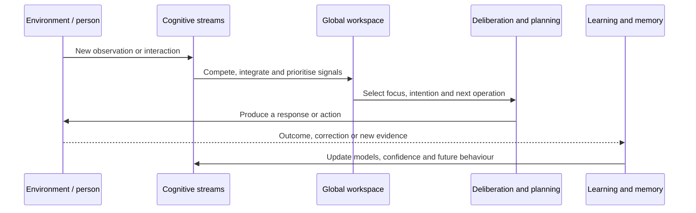

# Cognitive Organism - Beyond J.A.R.V.I.S.

This repository contains an experimental **cognitive organism**: a local-first research system that combines memory, perception, voice, reflection, planning, self-correction and an evolving visual representation of internal activity.

The ambition is to investigate how persistent state, internal drives, world models, memory, perception and self-evaluation can be assembled into a continuously operating cognitive architecture. It is not a chatbot project and is not presented as artificial general intelligence.

Its value will come from careful engineering, explicit instrumentation, honest evaluation and repeated testing with real people.

## System at a glance



## Cognitive cycle



## What the organism does

- **Interaction layer:** local or remote OpenAI-compatible model providers are used as one component of the organism, not as the organism itself.
- **Memory:** episodic and semantic memory, persistent user/interlocutor profiles, relations and retrieval.
- **Reasoning and planning:** intention extraction, causal and temporal reasoning, autonomous goals, long-horizon plans and action outcomes.
- **Self-correction:** explicit user corrections become behavioural evidence; complex tensions can be grouped into competing corrective strategies and evaluated over time.
- **Voice:** Whisper or faster-whisper speech recognition, configurable TTS providers and interruptible audio conversation.
- **Vision:** camera capture, image analysis, face recognition, vision memory and optional multimodal routing.
- **Cognitive workspace:** background signals from attention, curiosity, affect, identity, memory, planning and orchestration.
- **Observability:** cognitive health, traces, subsystem state and a live 3D organic sculpture representing current activity.
- **Local-first operation:** designed to run on the local machine and connect to local LM Studio or Ollama servers.

## Current status

The cognitive organism is an active research prototype. Some subsystems are mature enough for daily testing; others are deliberately exposed so that their limits can be measured. The interface and internal architecture are evolving together.

## Installation

### Linux

```bash
chmod +x setup.sh
./setup.sh
```

### Windows

Run `start.bat`. The script creates the Python virtual environment, installs Python dependencies, installs optional face-recognition support when possible, installs frontend dependencies, builds the React interface and starts the server.

The new interface is served at `http://localhost:8080/next/`.

The frontend is intentionally built during installation. A published checkout needs `frontend/src`, `frontend/public`, `frontend/package.json` and `frontend/package-lock.json`; `frontend/node_modules` and `frontend/dist` are generated and should not be committed.

## Local model setup

The organism works best for local testing with an OpenAI-compatible server such as LM Studio or Ollama. Configure the provider, model and base URL in the settings page or `config.json`. Keep API keys in `.env` or local configuration; never commit them.

## Testing

Python tests are in `tests/`. Frontend tests are in `frontend/tests/`.

```bash
python -m unittest discover -s tests -v
cd frontend
npm test
```

Some optional tests require the full virtual environment and external services. A test report should mention which providers, models and optional hardware were available.

## Help advance the research

New research testers are welcome, especially people who can evaluate one of these areas:

- multilingual conversation and response-length modes;
- LM Studio, Ollama and other OpenAI-compatible providers;
- audio latency, barge-in, STT and TTS provider selection;
- camera devices, face recognition and multimodal vision models;
- memory recall, user profiles and correction learning;
- autonomous goals, planning, causal reasoning and temporal understanding;
- accessibility, privacy, installation and failure recovery.

Useful tester reports include the operating system, Python and Node versions, provider/model, exact steps, expected result, observed result and a redacted log excerpt. Do not include API keys, face images or private conversation data.

## Privacy and safety

The organism can process text, microphone input, camera frames and face data. Run it only on a trusted machine, keep LAN exposure disabled unless deliberately needed, and review the local data directories before sharing diagnostics. The project is experimental and should not be used as the sole basis for medical, legal, safety-critical or personal security decisions.

## License

Add the project license before public release. Until then, treat this repository as source-available experimental software rather than assuming that redistribution terms are defined.
